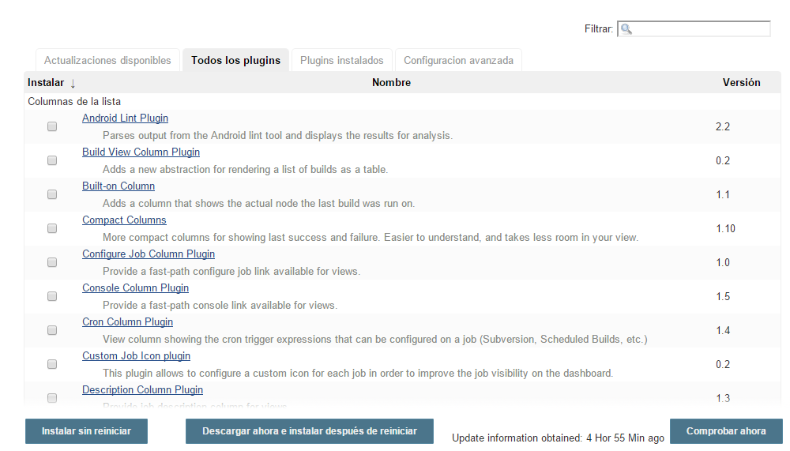
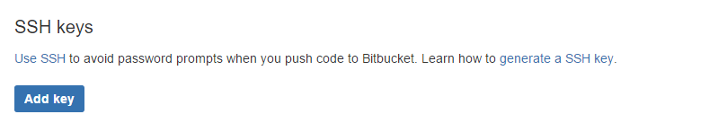
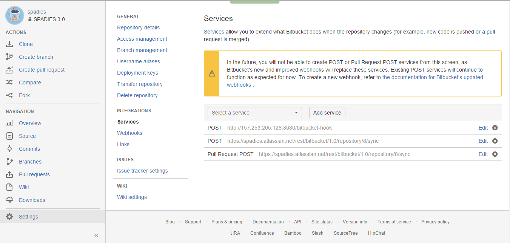

# Enlace Bitbucket - Jenkins
A continuación se presenta el procedimiento para enlazar Bitbucket con Jenkins, para permitir el proceso de integración contínua a partir de un repositorio.

## Instalación del Plugin de Bitbucket para Jenkins

En la página principal de jenkins dar clic en Administrar Jenkins, luego Administrar Plugins. Dar clic en la pestaña todos los plugins.



En la barra de búsqueda escribir Bitbucket Plugin, seleccionar el plugin correspondiente y hacer clic en Descargar ahora e instalar después de reiniciar.

## Intercambio de llaves con bitbucket

Entrar a Bitbucket > Manage Account y en el grupo Security seleccionar SSH Keys.



Entrar a la máquina donde se encuentra instalado jenkins y por línea de comando:

```
#!bash
su - jenkins
cat .ssh/id_rsa.pub             //Esto imprimirá la llave
```

Copiar la llave y dar clic en Add Key en Bitbucket Darle un nombre y copiar la llave.

## Configuración del repositorio

Entrar al repositorio, Dar clic en Settings > Services



Agregar el servicio `POST` con <jenkins_host>:<jenkins_port>/bitbucket-hook.

Este servicio notificará a jenkins por cada cambio que exista en el repositorio.

## Comprobar conección SSH
Para comprobar que existe conección SSH entre la máquina que aloja jenkins y Bitbucket ejecutar por línea de comandos:
```
#!bash
ssh -T git@bitbucket.org
```

Si la conexión es correcta aparecerá un mensaje para agregar la máquina Jenkins como un host conocido para Bitbucket. Seleccionar que Sí.