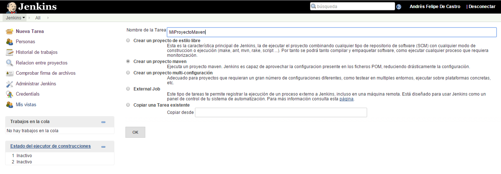
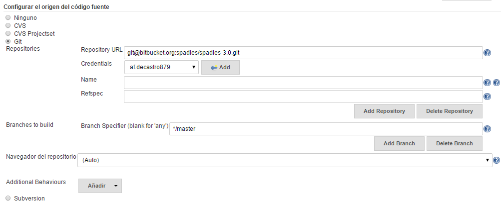
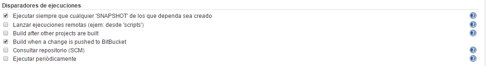
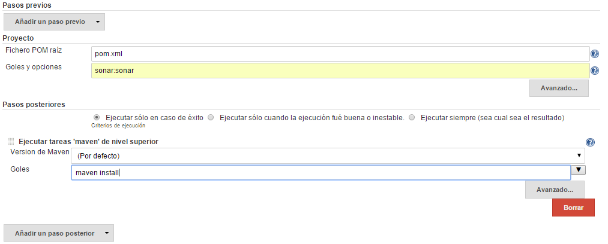
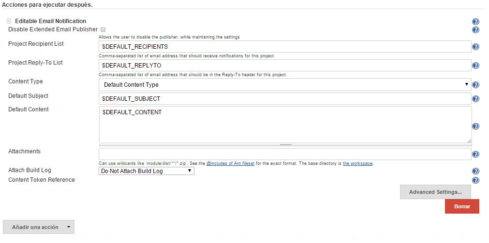

# Creación de un proyecto Maven

Para la utilización de Jenkins crearemos un proyecto de tipo Maven en esta herramienta. Para esto se debe entrar al servidor de Jenkins > Nueva Tarea y se seleccionar Nuevo proyecto Maven.

Posterior a esto, se deben definir las variables para el proyecto:

## Configurar el código fuente
Permite determinar de donde se extraerá el código fuente. En este caso será una fuente git. Se debe colocar la dirección del repositorio y las credenciales de acceso si este necesita autenticación.

## Disparadores de ejecuciones
Permite definir en qué momento se dispara una ejecución. En este caso cuando se cree un SNAPSHOT y cuando haya algún cambio en el repositorio.

## *Pipeline*
En esta sección se pueden definir pasos anteriores y posteriores a la ejecución de la primera instrucción de Maven. En este caso, se define el fichero raíz y la primera opcion es ejecutar `sonar:sonar` que es la instrucción maven para solicitar un análisis de código a sonar.
El paso posterior es ejecutar la tarea `maven install` que ejecutará todos los pasos de ejecución de pruebas, compilación empaquetado y despliegue automático.

## Acciones posteriores
En esta sección se pueden definir acciones que se ejecuten después del *pipeline* definido. Para este caso, deseamos correr una notificación por email, por lo que seleccionamos Añadir Acción > Editable Email Notification

Finalmente se guardan estas configuraciones y ya queda el proyecto maven listo para ser ejecutado por nuestro servidor de integración contínua.