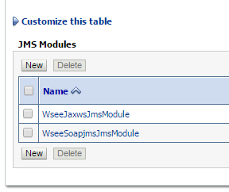
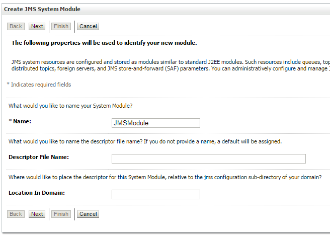
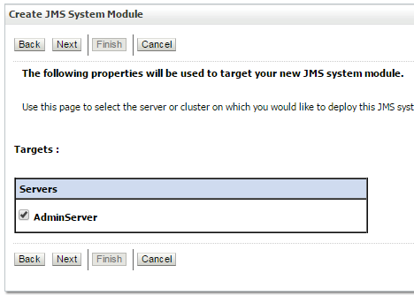
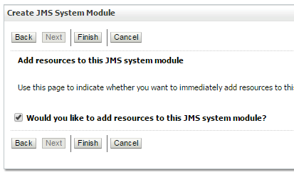
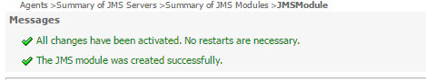
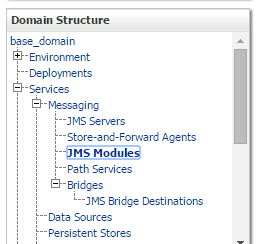
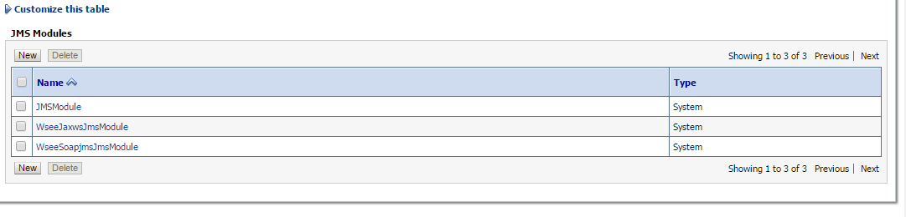

# Modulo JMS

La creación del Módulo JMS se debe realizar en el Servidor Weblogic destinado para el procesamiento de datos ingresando por la URL:

```
http://ip-servidor-core:7001/console/
```
## Paso 1

En el panel ***Domain Structure*** expanda ***Services*** y ***Messaging***. Luego seleccione ***JMS Modules***.


## Paso 2

En  ***JMS Modules*** dar clic en ***new***.



## Paso 3

En el campo ***Name*** escribir el nombre del Módulo JMS ***JMSModule***. Luego, hacer clic en el bóton ***Next***.



## Paso 4

En  en el campo ***Targets***  seleccionar el servidor ***AdminServer***. Luego, hacer clic en el bóton ***Next***.


## Paso 5

Seleccionar la opción ***would you like to add resources to this JMS system module?***. Luego, hacer clic en el botón ***Finish***.


## Paso 6

Si todo esto salió correctamente deberá mostrar el siguiente mensaje:


## Paso 7

En el panel ***Domain Structure*** expanda ***Services*** y ***Messaging***. Luego seleccione ***JMS Modules***.


## Paso 8

En JMS Modules deberá aparecer el módulo ***JMSModule*** 


