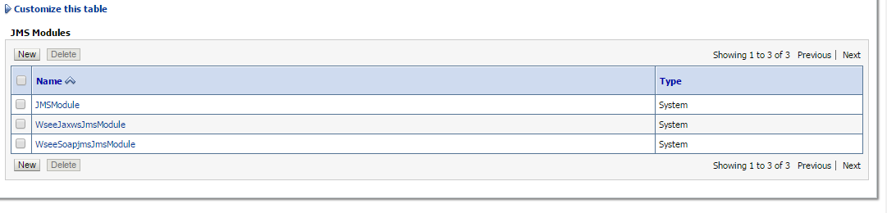

# Queue Destination

La creación de la Cola de Mensajería se debe realizar en el Servidor Weblogic destinado para el procesamiento de datos ingresando por la URL:

```
http://ip-servidor-core:7001/console/
```
## Paso 1

En el panel ***Domain Structure*** expanda ***Services*** y ***Messaging***. Luego seleccione ***JMS Modules***.


## Paso 2

En ***JMS Modules*** hacer clic en el botón ***New***.



## Paso 3

En  ***Summary of Resources*** hacer clice en el bóton ***new***.


## Paso 4

Seleccionar ***Queue*** y hacer clic en el botón ***Next***.


## Paso 5

En  en el campo ***Name***  escribir ***formatoQueue***. 
Luego en el campo ***JNDI Name*** escribir ***jms/formatoQueue***. Finalmente hacer clic en botón ***Next***


## Paso 6

En el campo ***Subdeployments*** hacer clic en el botón ***Create a New Subdeployments***


## Paso 7 
En el campo ***Subdeployments*** escribir ***formatoQueue***.


## Paso 8

En el campo ***Tarjets*** seleccionar el Servidor JMS ***JMSServer***.


## Paso 9

En ***Summary of Resources*** debe mostrar la cola de mensajería  con nombre formatoQueue. 


## Paso 10

Repetir los pasos nuevamente para la creación de las colas coherencia y cruce. Estas colas deben tener la configuración que aparece en la imagen.

