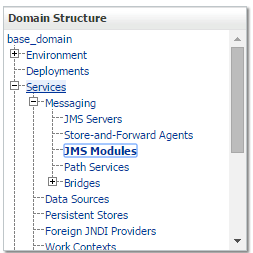
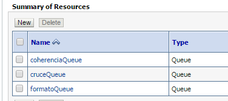
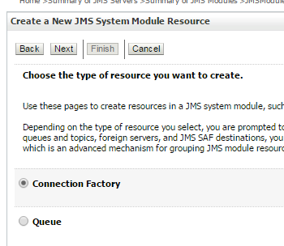
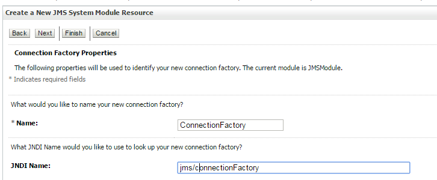
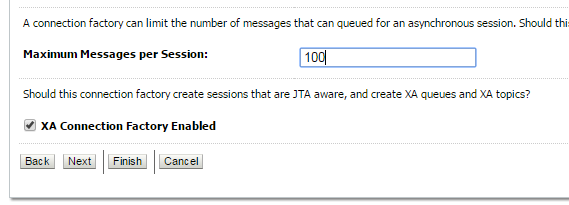
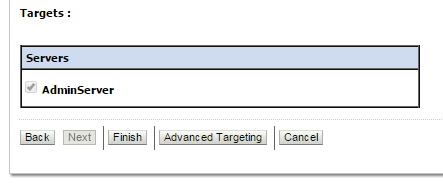
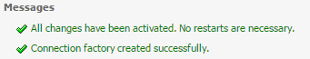

# Modulo JMS

La creación del Módulo JMS se debe realizar en el Servidor Weblogic destinado para el procesamiento de datos ingresando por la URL:

```
http://ip-servidor-procesamiento:7001/console/
```
## Paso 1

En el panel ***Domain Structure*** expanda ***Services*** y ***Messaging***. Luego seleccione ***JMS Modules***.



## Paso 2

En  ***Summary of Resources*** hacer clic en ***new***.



## Paso 3

Seleccionar ***Connection Factory***. Luego, hacer clic en el botón ***Next***



## Paso 4

En el campo ***Name*** escribir el nombre de la conexion ***ConnectionFactory***


## Paso 5

En el campo ***Maximum Masseges per Session*** escribir 100. Luego, seleccionar ***XA Conection Factory Enabled***. Finalmente, hacer clic en el botón ***Next***. 


## Paso 6

En el campo ***Targets*** seleccionar el servidor ***AdminServer***. Luego, hacer clic en el botón ***Finish***.


## Paso 7

Si todo está bien configurado, deberá mostrar el siguiente mensaje:



