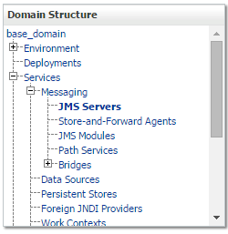
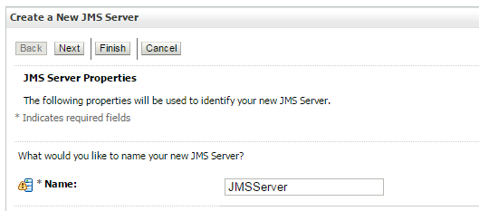
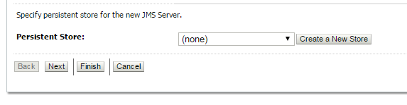
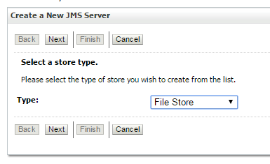
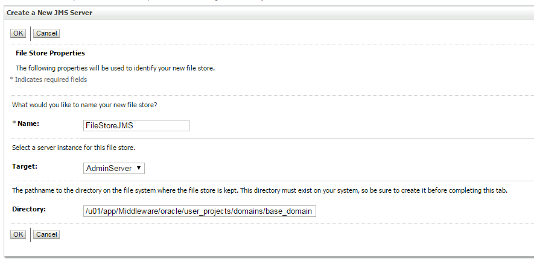
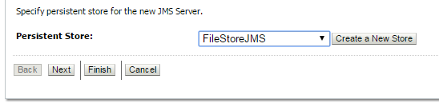
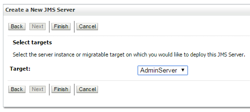
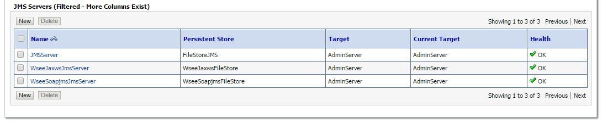

# Servidor JMS
La creación del servidor JMS se debe realizar en el Servidor Weblogic destinado para el procesamiento de datos ingresando por la URL:
 
```
http://ip-servidor-core:7001/console/
```
## Paso 1

En el panel ***Domain Structure*** expanda ***Services*** y ***Messaging***. Luego seleccione ***JMS Servers***.



## Paso 2

En  ***JMS Servers*** dar clic en ***new***.

![Git Paso 2(img/jmsserverpaso2.PNG)

## Paso 3

En el campo ***Name*** escribir el nombre del servidor JMS ***JMSServer***.



## Paso 4

En  en el campo ***Persistence Store***  hacer clic en el boton ***Create a New Store***.


## Paso 5

En el campo ***Type*** seleccionar ***File Store*** y luego hacer clic en el botón **Next***.


## Paso 6

En el campo ***Name*** escribir el nombre del File Store ***FlleStoreJMS***. Luego  en el campo ***Directory*** escribir la siguiente ruta:
```
/u01/app/Middleware/oracle/user_projecdts/domains/base_domain
```

Finalmente, hacer clic en el botón ***OK***


## Paso 7

En el campo ***Persistent Store*** seleccionar ***FileStoreJMS*** y luego hacer clic en el botón ***Next***. 


## Paso 8

En el campo ***Tarjet*** seleccione ***AdminServer*** y luego hacer clic en el botón ***Finish***. 


## Paso 9

En la lista de ***JMS Server*** deberá aparecer el servidor JMS que se acaba de crear. 

