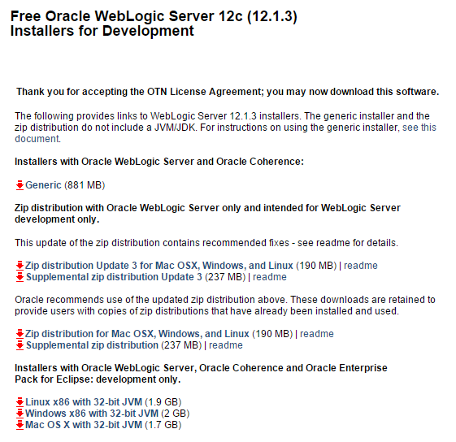

# Servidor WebLogic
A continuación se muestra el proceso de instalación del servidor WebLogic 12c en su versión 12.1.3 para las plataformas Linux CentOS 6.5 (Ambiente de Producción) y Windows (Ambiente de Desarrollo)

En este [enlace](../install.md) encuentra la URL disponible para la descarga.

Para realizar la descarga se debe realizar clic en el link Generic que se muestra en la siguiente imagen. Esto descargará un jar (fmv_12.1.3.0.0_wls.jar) que contiene la distribución para todas las plataformas:


 
## Instalación

Ir hasta el directorio de descarga del jar y ejecutar la siguiente línea de comando:
```
#!bat
java -jar fmw_12.1.3.0.0_wls.jar

```
