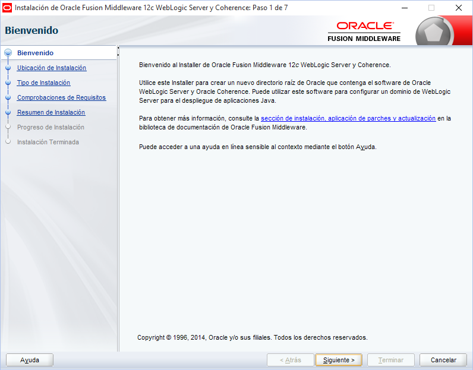
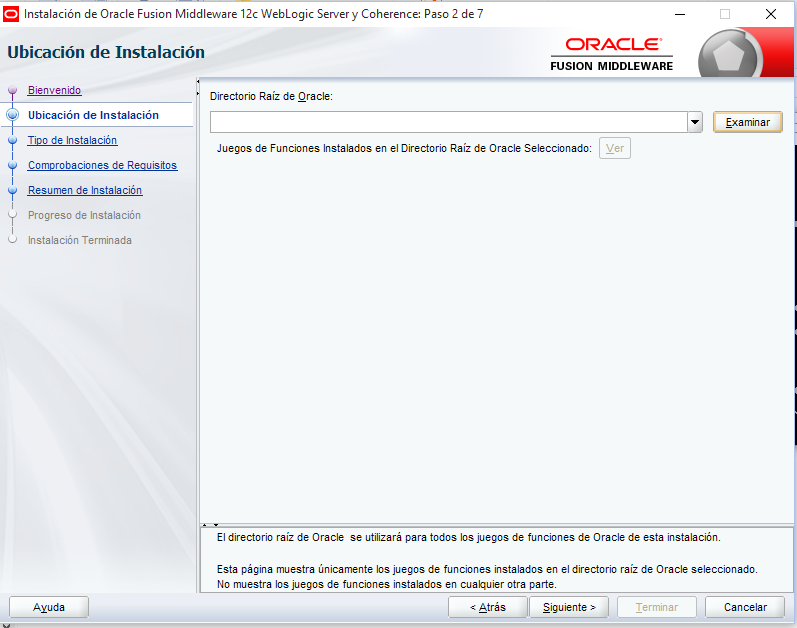
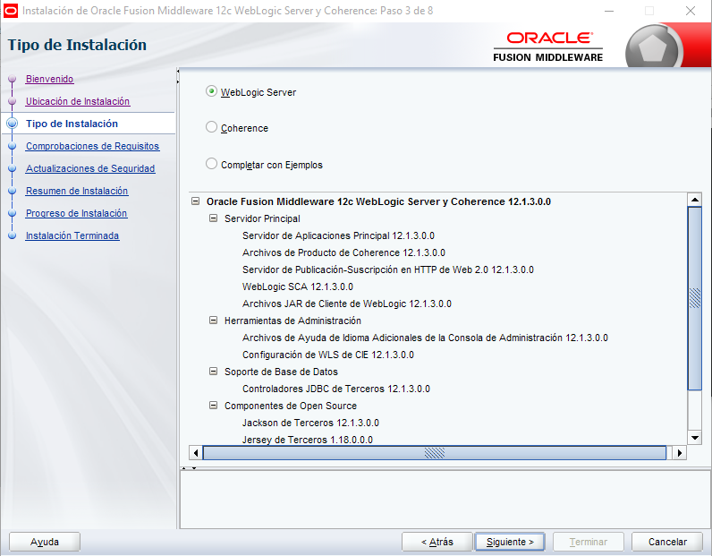
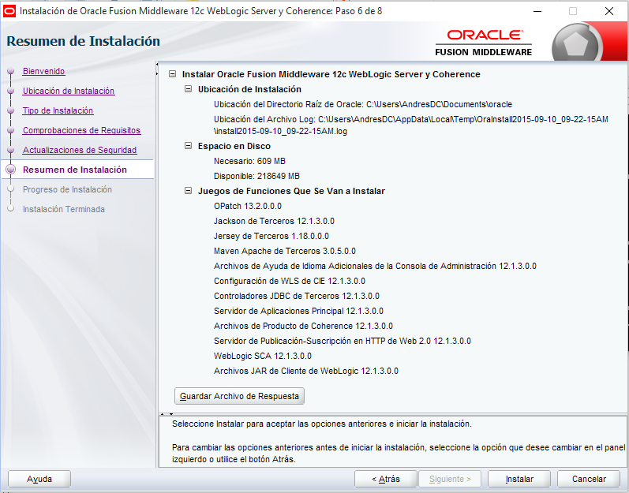
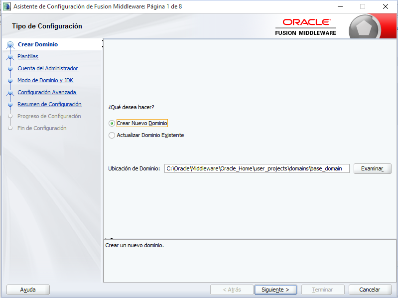
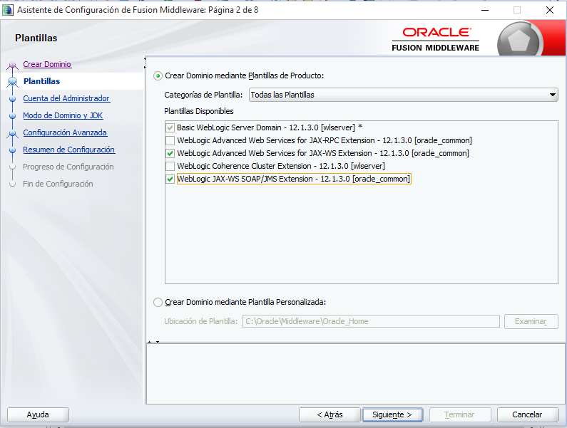
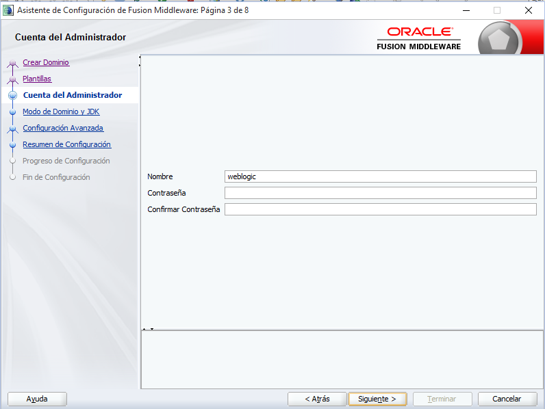
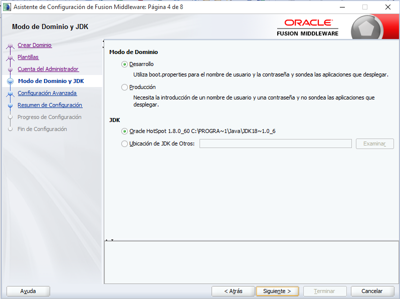
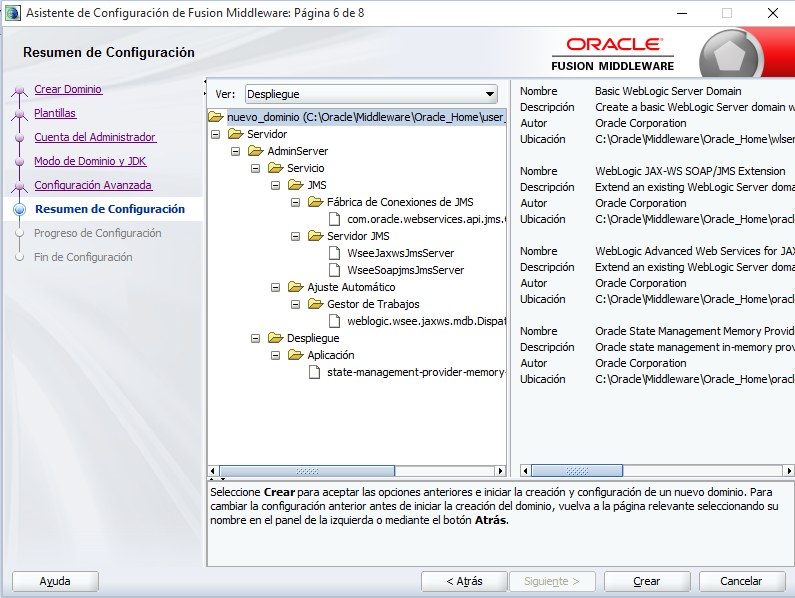

# Servidor WebLogic
A continuaci�n se muestra el proceso de instalaci�n del servidor WebLogic 12c en su versi�n 12.1.3 para las plataformas Linux CentOS 6.5 (Ambiente de Producci�n) y Windows (Ambiente de Desarrollo)

En este [enlace](../install.md) encuentra la URL disponible para la descarga.

Para realizar la descarga se debe realizar clic en el link Generic que se muestra en la siguiente imagen. Esto descargar� un jar (fmv_12.1.3.0.0_wls.jar) que contiene la distribuci�n para todas las plataformas:


 
## Instalaci�n

Ir hasta el directorio de descarga del jar y ejecutar la siguiente l�nea de comando:
```
#!bat

java -jar fmw_12.1.3.0.0_wls.jar
```
Se abrir� la siguiente ventana:



Dar clic en siguiente, seleccionar la ruta de instalaci�n y dar clic en siguiente



Seleccionar WebLogic Server y dar clic en siguiente



Mostrar� el resumen de la instalaci�n. Dar clic en instalar:



Al terminar la instalaci�n preguntar� si desea iniciar el asistente de configuracion. Este permitira crear un nuevo dominio. Se mostrara la siguiente pantalla:



Seleccionar crear un nuevo dominio y dar clic en siguiente:



Indicar el nombre de la cuenta de administrador y una contrase�a v�lida. Dar clic en siguiente:



Seleccionar modo de dominio de desarrollo y la ruta del JDK instalado. Dar clic en siguiente hasta llegar al resumen de la configuraci�n.



Seleccionar Crear para crear el dominio con dicha configuraci�n



Con esto queda finalizada la instalaci�n del Servidor WebLogic. 

## Inicio y Finalizaci�n del servidor

Para iniciar el servidor se requiere ir a la ruta del Middleware indicada en la primera ventana de la instalaci�n del servidor a traves de l�nea de comando.
Una vez en esta ruta:

```
#!bat

cd user_projects/domains/base_domain/bin
startWebLogic.cmd

```

Para pararlo basta con:

```
#!bat

cd user_projects/domains/base_domain/bin
stopWebLogic.cmd

```