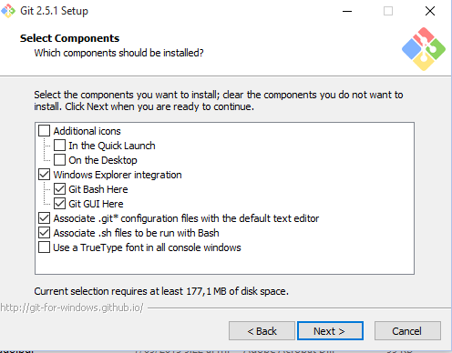
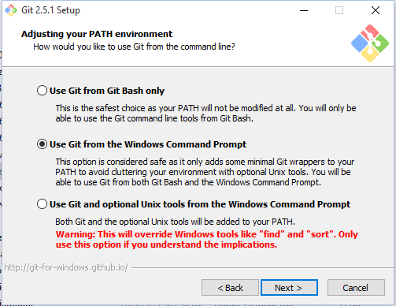
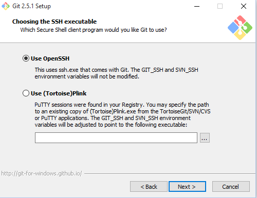

# Instalación de Git
A continuación se presenta el procedimiento para la instalación de git en linux CentOS 6.5 y Windows.

## Linux CentOS
Ejecutar por línea de comandos:
```
#!bash
yum install git

```
Esto instalará la última versión de git estable.

## Windows
Descargar el ejecutable para windows en el siguiente [enlace](https://git-scm.com/downloads). Ejecutar el descargable y seleccionar las siguientes opciones:







