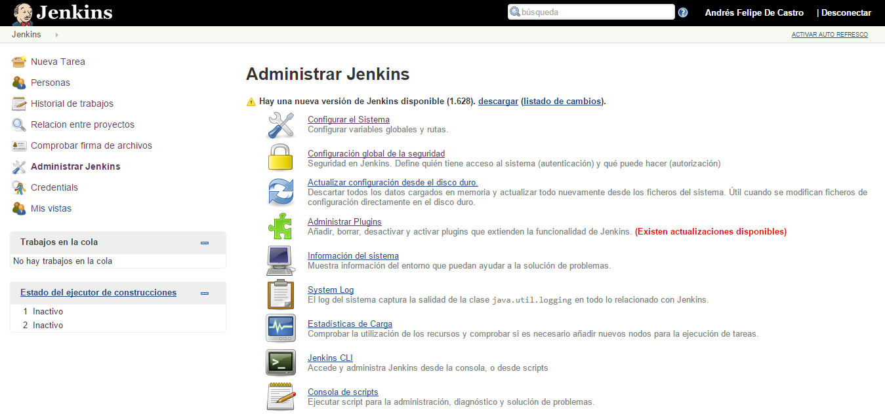
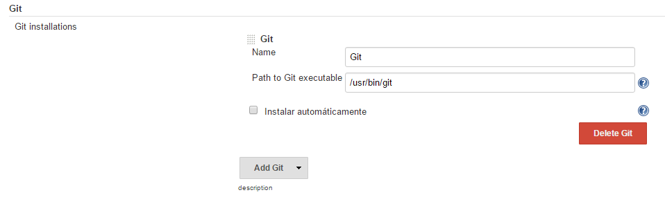
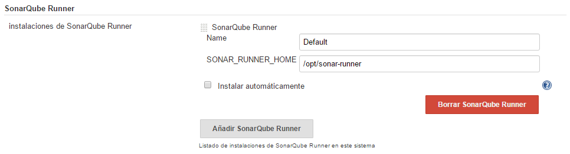
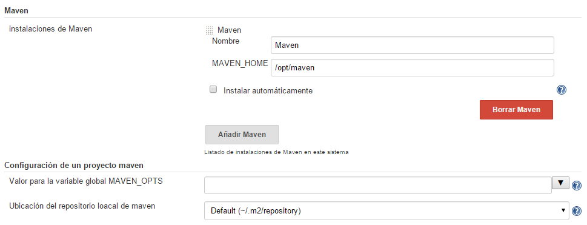
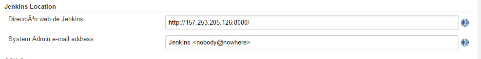
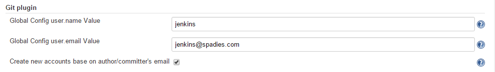
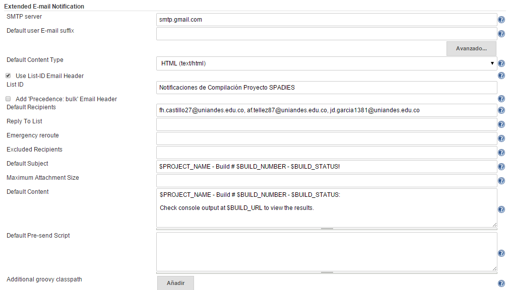
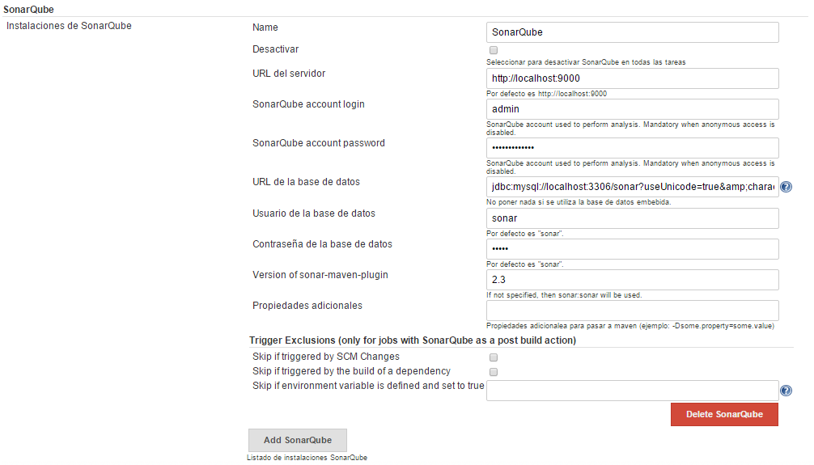

# Configuraciones Globales de Jenkins
A continuación se presentan todas las configuraciones globales de Jenkins para que funcione como el servidor de integración contínua en el proyecto SPADIES 3.0.

## Instalación de Plugins
La siguiente es la lista de plugins necesaria:
+ Bitbucket Plugin
+ Email Extension Plugin
+ Git plugin
+ Maven Integration Plugin
+ SonarQube Plugin

Para la instalación de estos plugins es necesario ingresar a Jenkins > Administrar Jenkins > Administrar Plugins

Seleccionar la pestaña Todos los Plugins y a través de la barra de búsqueda seleccionar los plugins para la instalación. Dar clic en instalar ahora e instalar después de reiniciar.

## Configurar el sistema
Es necesaria la configuración de todas las variables de entorno y rutas que utilizará Jenkins. Para esto, es necesario ingresar a Jenkins > Administrar Jenkins > Configurar Sistema. A continuación se muestran los valores de la configuración para cada sección:

### JDK

![Paso 3] (img/jenkins_3stp.png)

### Git

### SonnarQube Runner

### Maven

### Jenkins Location

### Git Plugin

### Extended E-mail Notification

### SonarQube

