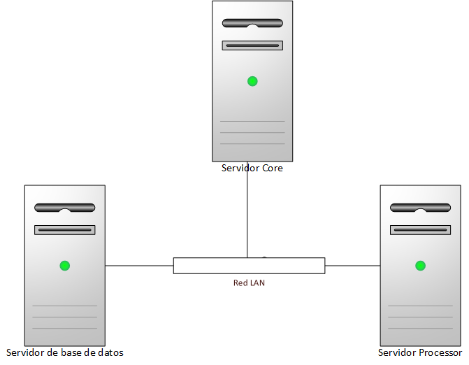

# Hardware
En la siguiente imagen se presenta las máquinas requeridas para el funcionamiento del SPADIES.

## Especificaciones

| Nombre | Sistema Operativo |Memoría RAM| Procesador | Almacenamiento|
|:------------:|:-------------:|:-------------:|:-------------:|:-------------:|
|Servidor Core  |CentOS release 6.7 |32 GB | 8 Cores de 2.6 GHz | 300GB|
|Servidor Processsor|CentOS release 6.7 |64 GB|8 Cores de 2.6 GHz| 500GB|
|Servidor Base de Datos|CentOS release 6.7 |32 GB|8 cores de 2.6 GHz | 1TB|
